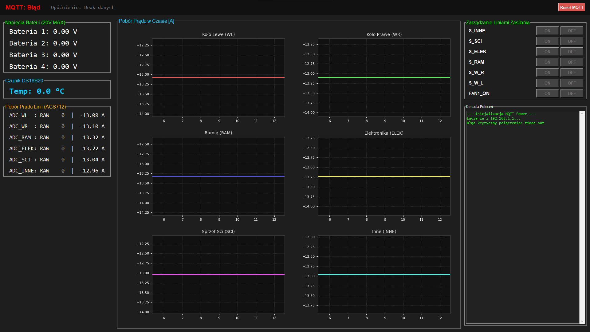

# ORION_VI_POWER - System Zarządzania Zasilaniem (Power Management System)



## 1. Opis Ogólny (Executive Summary)
**ORION_VI_POWER** to kompleksowy system dystrybucji, monitorowania i zarządzania zasilaniem, zaprojektowany (prawdopodobnie na potrzeby łazika lub platformy robotycznej). Projekt składa się z dwóch integralnych części:
1. **Low-level (ESP32 / Arduino C++)**: Odpowiada za bezpośrednie sterowanie przekaźnikami/tranzystorami, odczyt czujników prądu (ACS712), napięcia baterii oraz temperatury (DS18B20).
2. **Base Application (Python / Tkinter)**: Interfejs graficzny (GUI) działający na stacji bazowej, służący do monitorowania telemetrii w czasie rzeczywistym oraz zdalnego sterowania obwodami zasilania.

Komunikacja między układami odbywa się przewodowo za pośrednictwem modułu Ethernet (W5500) i protokołu **MQTT**.

---

## 2. Architektura Sieciowa i MQTT

System opiera się na lokalnej sieci przewodowej. 

### Parametry Sieciowe:
* **Adres IP Brokera MQTT (Base Station)**: `192.168.1.1`
* **Port MQTT**: `1883`
* **Adres IP Modułu Zasilania (ESP32)**: `192.168.1.56`
* **Adres MAC ESP32**: `DE:AD:BE:EF:FE:56`
* **Klient MQTT ID**: `ESP32_Power_Module`

### Topiki MQTT:
* `Power/cmd` - Kanał dowodzenia, wysyłany przez stację bazową do ESP32.
* `Power/feedback` - Kanał telemetrii, wysyłany przez ESP32 do stacji bazowej (częstotliwość ok. 1Hz / 1000ms).

---

## 3. Komunikacja i Przesył Danych (Payloads)

Dane przesyłane są w lekkim formacie **JSON**.

### Struktura wiadomości sterującej (`Power/cmd`):
Aplikacja bazowa wysyła komendy włączające/wyłączające poszczególne linie:

```json
{
  "S_INNE": 1,
  "S_SCI": 0,
  "FAN1_ON": 1
}
```
*Wartość `1` oznacza stan WYSOKI (włączenie), `0` - stan NISKI (wyłączenie).*

### Struktura wiadomości telemetrycznej (`Power/feedback`):
Moduł ESP32 raportuje wszystkie aktualne odczyty z czujników:
```json
{
  "temp_c": 35.6,
  "bat_1_v": 11.8,
  "bat_2_v": 12.1,
  "bat_3_v": 12.0,
  "bat_4_v": 11.9,
  "adc_wl": 3012,
  "adc_wr": 3008,
  "adc_ram": 3050,
  "adc_elek": 3036,
  "adc_sci": 2994,
  "adc_inne": 2976
}
```
*Uwaga: Wartości `adc_*` przesyłane są jako dane surowe (RAW) z 12-bitowego przetwornika ADC ESP32. Przeliczenie na Ampery odbywa się po stronie GUI.*

---

## 4. Konfiguracja Sprzętowa (Pinout ESP32)

Kluczowe przypisania pinów zdefiniowane w pliku `Pins.h`:

### Sterowanie (Przełączniki / MOSFETy):
* `S_INNE_PIN` (Inne): **GPIO 2**
* `S_SCI_PIN` (Aparatura Naukowa): **GPIO 0**
* `S_ELEK_PIN` (Główna Elektronika): **GPIO 16**
* `S_RAM_PIN` (Ramię Robotyczne): **GPIO 17**
* `S_W_R_PIN` (Koła Prawe): **GPIO 21**
* `S_W_L_PIN` (Koła Lewe): **GPIO 22**
* `FAN1_ON_PIN` (Wentylator chłodzący): **GPIO 12**

### Pomiary Prądu (ACS712 - 3.3V ADC):
* `ADC_WL_PIN`: **GPIO 32**
* `ADC_WR_PIN`: **GPIO 33**
* `ADC_RAM_PIN`: **GPIO 25**
* `ADC_ELEK_PIN`: **GPIO 26**
* `ADC_SCI_PIN`: **GPIO 27**
* `ADC_INNE_PIN`: **GPIO 14**

### Pomiary Napięcia (Baterie - Dzielnik napięcia max 21V -> 2.69V):
* `BAT_1_ADC_PIN`: **GPIO 35**
* `BAT_2_ADC_PIN`: **GPIO 34**
* `BAT_3_ADC_PIN`: **GPIO 39**
* `BAT_4_ADC_PIN`: **GPIO 36**

### Komunikacja W5500 (SPI) i Czujniki:
* `WIZ_MOSI`: **GPIO 23** | `WIZ_MISO`: **GPIO 19**
* `WIZ_SCLK`: **GPIO 18** | `WIZ_SCN`: **GPIO 4** | `WIZ_RST`: **GPIO 5**
* `TEMP_PIN` (DS18B20): **GPIO 13**
* `NEOPIXEL_PIN` (WS2812): **GPIO 15** (sygnalizuje status MQTT)

---

## 5. Struktura Repozytorium

```text
ORION_VI_POWER/
│
├── Base_Application/            # Stacja Bazowa (Python / GUI)
│   ├── power.py                 # Skrypt startowy GUI
│   ├── gui.py                   # Budowa interfejsu (Tkinter, Matplotlib)
│   ├── comms.py                 # Zarządzanie klientem Paho MQTT
│   ├── config.py                # Konfiguracja IP, Portów i kalibracja ACS712
│   └── utils.py                 # Zarządzanie współdzielonym stanem (AppState)
│
├── Low_level_code/              # Oprogramowanie sprzętowe
│   ├── Orion_power/             # Główny kod ESP32
│   │   ├── Orion_power.ino      # Pętla główna, obsługa MQTT, W5500, JSON
│   │   └── Pins.h               # Definicje wszystkich pinów GPIO
│   │
│   └── ORION_POWER_TEST/        # Skrypt testowy i diagnostyczny
│       └── ORION_POWER_TEST.ino # Sterowanie przekaźnikami przez Serial Monitor
│
├── README.md                    # Dokumentacja techniczna (ten plik)
└── LICENSE                      # Licencja MIT
```

---

## 6. Kalibracja i Aplikacja Bazowa

Interfejs graficzny został napisany w Pythonie przy użyciu `tkinter` oraz wykresów z `matplotlib`.
Odpowiada on za **przeliczanie wartości RAW z przetwornika na rzeczywiste pomiary prądu**.

Kalibracja przeprowadzana jest w pliku `Base_Application/config.py`:
* `ACS712_ZERO_RAW`: Wartości odniesienia dla 0 Amperów na każdym kanale (indywidualne odchylenia dla ADC).
* `ACS712_SENSITIVITY`: Ustawione na `0.185` (typowo dla układu 5A). W przypadku zmiany sprzętowej na wersje 20A lub 30A, parametr należy zmienić (np. na `0.100`).

Baterie w ESP32 (`Orion_power.ino`) są skalowane współczynnikami `bat_multipliers` (domyślnie między `7.286` a `7.8`). Należy je dostroić podczas prac serwisowych używając multimetru.

---

## 7. Instrukcja Uruchomienia

### Krok 1: Wgranie kodu na ESP32
1. Otwórz `Low_level_code/Orion_power/Orion_power.ino` w środowisku Arduino IDE / PlatformIO.
2. Upewnij się, że posiadasz zainstalowane biblioteki: `Ethernet`, `PubSubClient`, `ArduinoJson`, `OneWire`, `DallasTemperature`, `Adafruit NeoPixel`.
3. Skompiluj kod i wgraj na ESP32 podpięte po USB.

### Krok 2: Uruchomienie Stacji Bazowej
1. Upewnij się, że komputer stacji bazowej znajduje się w tej samej sieci i posiada IP umożliwiające uruchomienie brokera na `192.168.1.1`.
2. Zainstaluj wymagane pakiety Pythona: 
   ```bash
   pip install paho-mqtt matplotlib
   ```
3. Uruchom serwer MQTT (np. Mosquitto) na komputerze hosta.
4. Odpal aplikację GUI:
   ```bash
   cd Base_Application
   python power.py
   ```
   *Aplikacja domyślnie uruchamia się w trybie pełnoekranowym. Użyj klawisza `ESC`, aby wyjść z trybu fullscreen.*
"""
